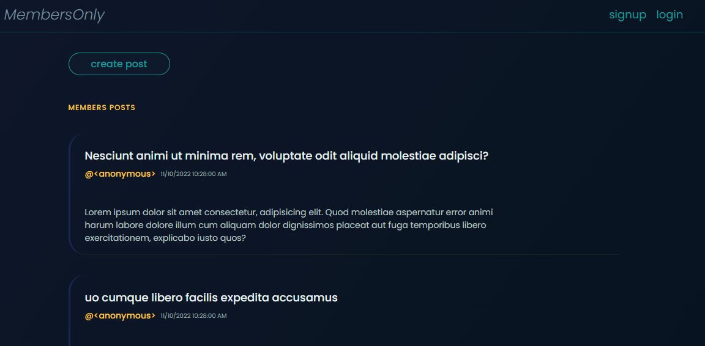
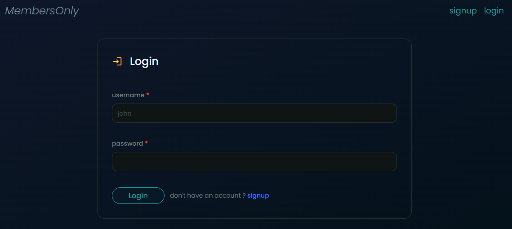

# Members Only

Exclusive clubhouse where members can write anonymous posts.

Inside the clubhouse, members can see who the author of a post is, but outside they can only see the story.

- anonymous user can see the messages but not the authors of them
- after signup/login, user can post messages
- after joining the club, user can see authors of the messages
- admin user can do all of the above + deleting messages

[**_👉 Live Preview_**](https://members-only-oqob.onrender.com)

Built with HTML, SCSS, NodeJS, Express, and MongoDB.

**club joining password is `club@member:secret123`**

## Screenshots

### Posts seen from anonymous user

### login

